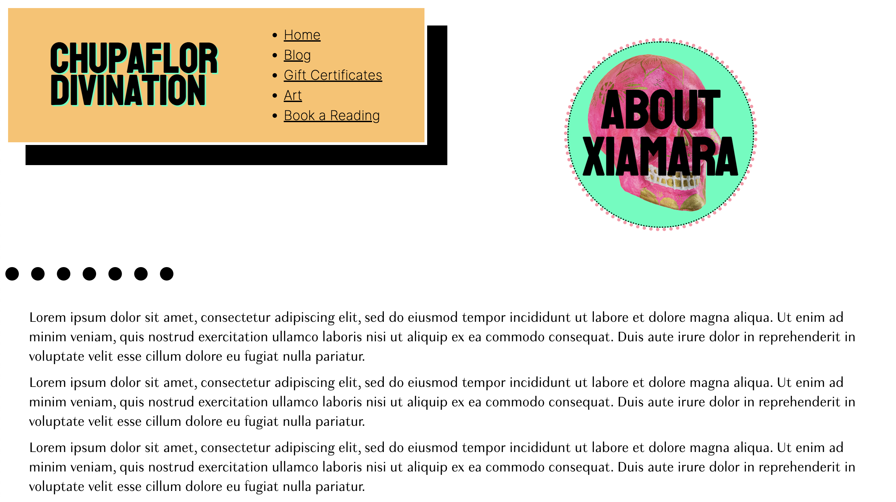
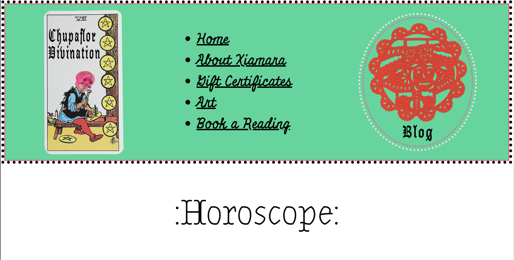

# Tarot-Pro

## Overview

This project is a mock-up website designed as a potential replacement for a client's existing website. This was one of my first projects I worked on for somebody else and one of the first projects I worked on post coding boot camp. I enjoyed coming up with the design and color schemes for her website based off the various pieces of art she created.

## Features

* Under Construction *

## Technologies Used

- HTML
- CSS
- JavaScript

## Photos

### Home page

### About page

### Blog / Horoscope page

